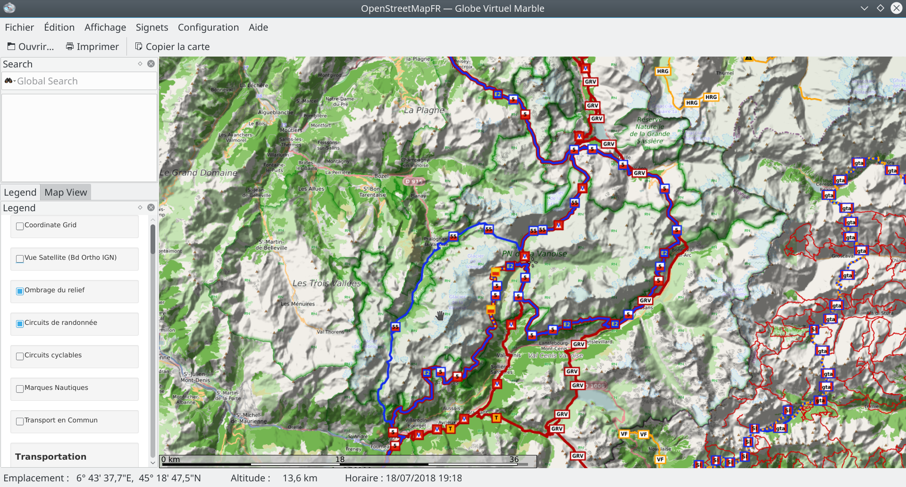
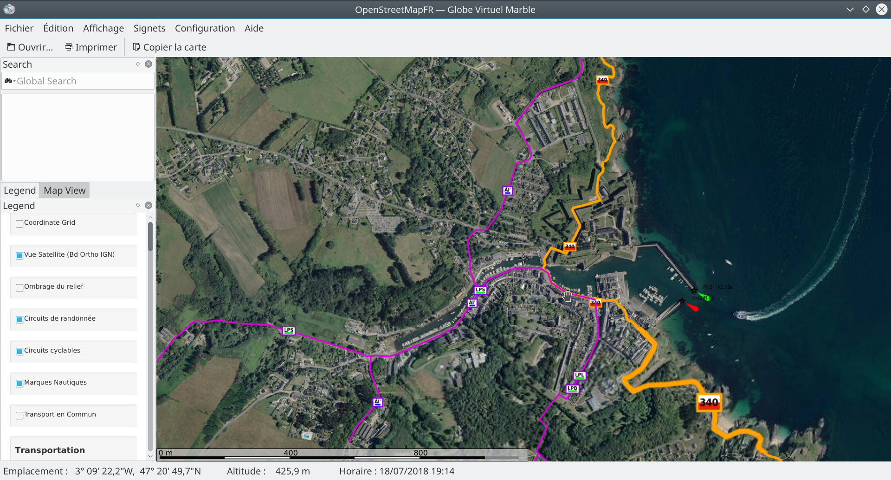

OSM-FR integration into KDE marble
=====================================

The french community did a very good job at providing an `OpenStreetMap rendering <http://tile.openstreetmap.fr/>`_ well adapted for french people.

The virtual globe `Marble <https://marble.kde.org/>`_ from KDE is also a good software to navigate through the world.

This project provides a Marble map that uses OSM-FR rendering. It also provides HillShading as an option.

Any improvement is welcome!

:Author: Adrien Grellier <perso@adrieng.fr>
:Date: 2017-05-05
:License: BSD 3-clause

Install
--------

To browse the maps osmfr into marble, just clone the repo: ::

  cd ~/.local/share/marble/maps/earth
  git clone https://github.com/adrien-github/osmfr.git

Privacy
-------- 

This software contacts the following servers:

- **\*.tile.openstreetmap.fr** for the map tiles (connexion not secured, HTTP)
- **proxy-ign.openstreetmap.fr** for the BD Ortho IGN tiles
- **\*.tiles.wmflabs.org** for the hillshading (connexion not secured, HTTP)
- **tile.waymarkedtrails.org** for the Hiking and Cycling overlay
- **tiles.openseamap.org** for the Seamarks overlay (connexion not secured, HTTP)
- **openptmap.org** for the Public Transport Overlay (connexion not secured, HTTP)

Screenshots
------------

Here is some screenshots of the app :

Hiking path in la Vanoise, Alpes :

Belle-île Harbour, with seamarks, Hiking and Cycling path:

.. vim:set filetype=rst:
